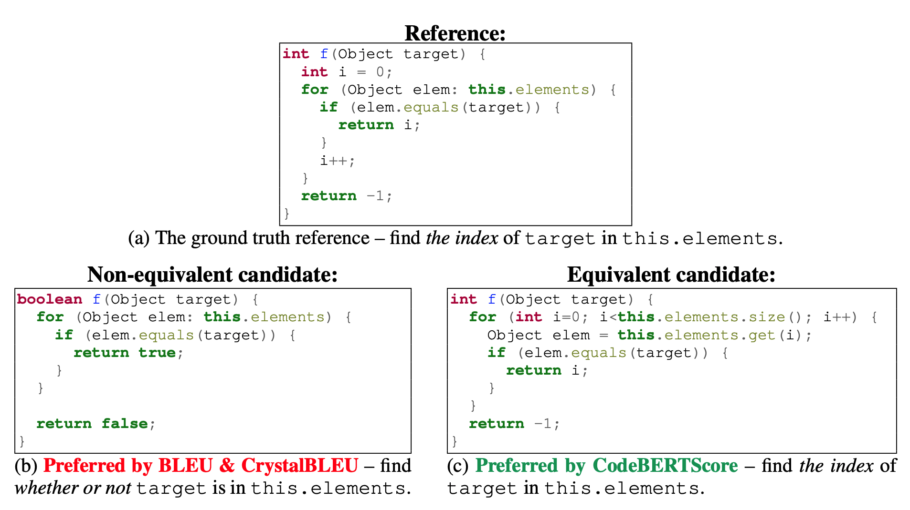
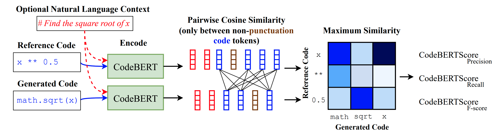
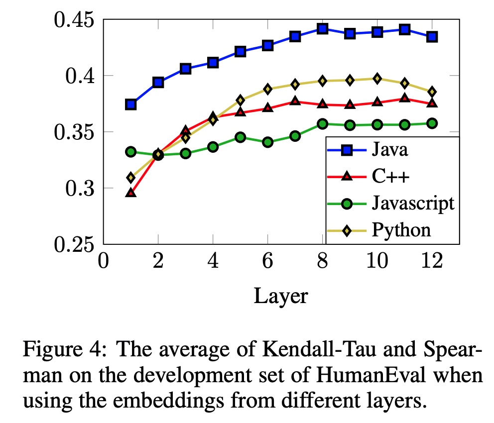
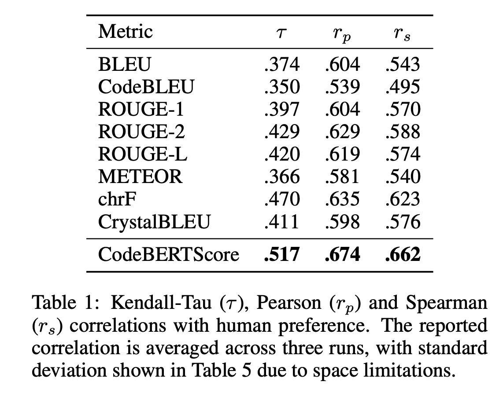
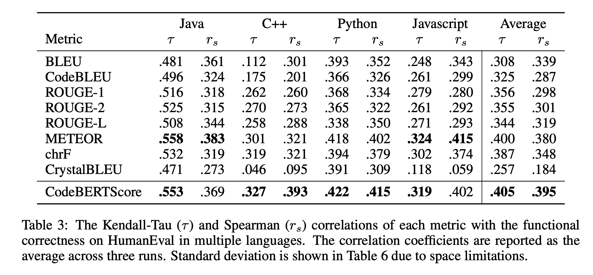

# CodeBERTScore
This is the official implementation of the paper:

Shuyan Zhou, Uri Alon, Sumit Agarwal, Graham Neubig, [CodeBERTScore: Evaluating Code Generation with Pretrained Models of Code](https://arxiv.org/pdf/2302.05527.pdf)

CodeBERTScore is an Automatic Evaluation Metric for Code, based on [BERTScore](https://arxiv.org/abs/1904.09675).
This repository is based on the code of [BERTScore](https://github.com/Tiiiger/bert_score), and we are grateful to the authors for releasing their code.

_**April 2023**_ - CodeBERTScore is now available on [pypi](https://pypi.org/project/code-bert-score/), which means that you can simply `pip install code-bert-score`!

---
* [Example](#example)
* [How does it work?](#how-does-it-work)
* [Usage](#usage)
* [Additional Features](#additional-features)
* [Backend Model](#backend-model)
* [Training](#training)
* [Evaluation](#evaluation)
    + [Human Evaluation](#human-evaluation)
    + [Functional Correctness](#functional-correctness)
* [Citation](#citation)

## Example:



Figure (a) shows a reference code snippet in Java. Figures (b) and (c) show two generated predictions. Among these two candidates and given the reference, BLEU prefers (scores higher) the code in (b), which is not functionally equivalent to the reference, while CodeBERTScore prefers the code in (c), which is functionaly equivalent to the reference.

## How does it work?



As BERTScore, CodeBERTScore leverages the pre-trained contextual embeddings from a model such as CodeBERT and matches
words in candidate and reference sentences by cosine similarity.
Differently from BERTScore, CodeBERTScore also encodes natural language input or other context along with the generated code, but does not use that context to compute cosine similarities.

This example shows how CodeBERTScore can compute the similarity between the Python expressions `x ** 0.5` and `math.sqrt(x)`, which are functionally equivalent, even though they have very few overlapping tokens.


## Usage
```
import code_bert_score
pred_results = code_bert_score.score(cands=predictions, refs=refs, lang='python')
```
Where `pred_results` is a 4-tuple of `(precision, recall, F1, F3)`, where each is a 1-D tensor of scores for each prediction-reference pair. `F3` is similar to the well-known `F1` score, that considers recall 3 times as important as precision. See the [definition on Wikipedia](https://en.wikipedia.org/wiki/F-score#F%CE%B2_score).

See our [example.py](./example.py) script. Additional details are shown in the original BERTScore [demo notebook](./example/Demo.ipynb).

## Huggingface 🤗 Models
We fine-tuned the `microsoft/codebert-base-mlm` model for 1,000,000 steps (with `batch_size=32`) on several languages separately.

We released the following models to the Huggingface hub:
* `neulab/codebert-python` (the default model for `lang='python'`)
* `neulab/codebert-javascript` (the default model for `lang='javascript'` or `'js'`)
* `neulab/codebert-c` (the default model for `lang='c'`)
* `neulab/codebert-cpp` (the default model for `lang='cpp'` or `'c++'`)
* `neulab/codebert-java` (the default model for `lang='java'`)

The appropriate model will be loaded automatically when passing the `lang` argument to the `score(..)` function, for example: `lang='python'`. 
For other uses, these models can be loaded using (for example):
```python
from transformers import AutoTokenizer, AutoModelForMaskedLM

tokenizer = AutoTokenizer.from_pretrained("neulab/codebert-python")
model = AutoModelForMaskedLM.from_pretrained("neulab/codebert-python")
```

## Additional Features

* We found that in NL->Code problems, more accurate results are achieved by encoding the NL `sources` with the code prediction, but then measuring similarity only for the encoded code:

```
pred_results = code_bert_score.score(cands=predictions, refs=refs, lang='python', sources=sources)
```

* We also found that using Inverse Document Frequencies improve the results, similarly to the original BERTScore. We included an example script that shows how to precompute them here [compute_idf.py](https://github.com/neulab/code-bert-score/blob/main/compute_idf.py). Then, the resulting dictionary can be used with the argument `idf=idf_dict`.
Our IDF dicts can be found in [./idf_dicts/](./idf_dicts/).

* Tuning the layer that the similarity is computed from is also helpful, using `num_layers=N` where `N` is between 5-10: 



* We found that more accurate results are achieved by encoding the *entire* inputs, but measures the similarity only between non-punctuation and non-whitespace tokens. To disable the removal of punctuation toksn, use `no_punc=False`. 


See also our [example.py](./example.py) script. Additional details are shown in the original BERTScore [demo notebook](./example/Demo.ipynb).

## Training
The [`run_mlm.py`](./run_mlm.py) script can be used to fine-tune the base model `microsoft/codebert-base-mlm` on specific languages.

## Evaluation
The code to reproduce the results in the paper can be found in the [evaluation](./evaluation/README.md).
### Human Evaluation



We find that CodeBERTScore is more correlated with human preference compared to a variety of common metrics. See more details in the [paper](https://arxiv.org/pdf/2302.05527.pdf).

### Functional Correctness



We find that CodeBERTScore is more correlated with functional correctness compared to a variety of common metrics. See more details in the [paper](https://arxiv.org/pdf/2302.05527.pdf).

## Citation
```
@article{zhou2023codebertscore,
  url = {https://arxiv.org/abs/2302.05527},
  author = {Zhou, Shuyan and Alon, Uri and Agarwal, Sumit and Neubig, Graham},
  title = {CodeBERTScore: Evaluating Code Generation with Pretrained Models of Code},  
  publisher = {arXiv},
  year = {2023},
}
```
